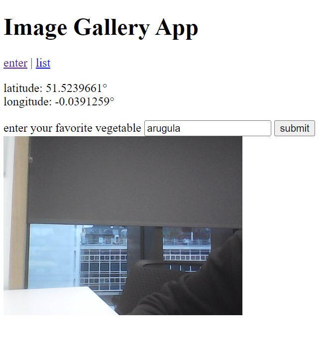

# Image Gallery App

## Overview

The Image Gallery App is a web-based application that allows users to take selfies with their webcams, tag the images with their favorite items, and automatically capture the geographical coordinates of the location where the selfie was taken. The images, along with the latitude, longitude, and user-defined tags, are encoded in base64 and stored in a database for later retrieval and gallery display.

## Features

- **Selfie Capture**: Users can take selfies directly through the web interface.
- **Geolocation**: The app retrieves and displays the user's current latitude and longitude.
- **Base64 Encoding**: Selfie images are encoded in base64 format for efficient storage.
- **Tagging**: Users can add a personal tag to each selfie, such as their favorite vegetable.
- **Database Storage**: All data is securely stored in a database for gallery display and management.

## Installation

1. Clone the repository:
   ```sh
   git clone (https://github.com/valleyofblackpanther/IssHUB)t
   ```
2. Navigate to the project directory:
   ```sh
   cd image-gallery-app
   ```
3. Install dependencies:
   ```sh
   npm install
   ```

## Usage

To start the application, run:

```sh
npm start
```

Open your web browser and navigate to `http://localhost:3000` to access the app.


## Screenshots


